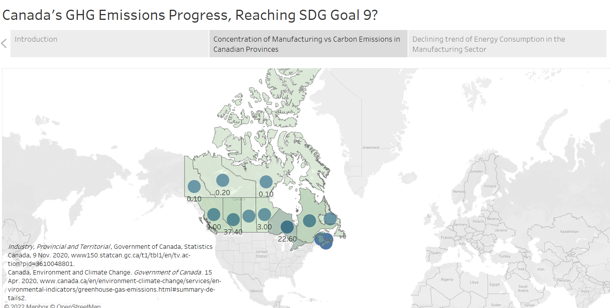

## Projects

- Understanding Canada's GHG Emissions through Industrial Composition:
Contestant for 5th Annual UNB Data Visualization Challenge (Completed as a Tableau Project, March 2021)

 

## Involvements

- Student Panelist Speaker for <a href="https://tedxohiostate.wixsite.com/tedxohiostateu/polymath">Polymath, a TEDxOhioStateUniversity event.</a> (January 2022)

